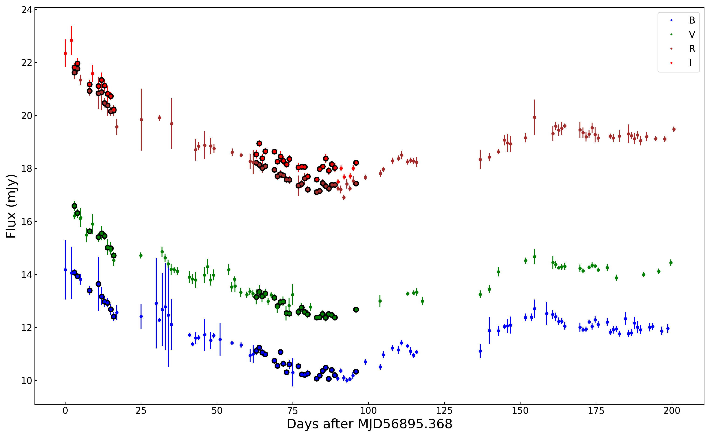

# PFVG_AA2021.jl

Application of the probabilistic flux variation gradient (PFVG) method, as presented
in Gianniotis, N., Pozo Nunez, F., and Polsterer, K.L. (2021). An implementation of the method can be found here [ProbabilisticFluxVariationGradient.jl](https://github.com/HITS-AIN/ProbabilisticFluxVariationGradient.jl).

In the following examples we apply the PFVG method on observations from the source
3C120. The light curves for 3C120 have been taken from the published work of [Ramolla et al. (2018)](https://www.aanda.org/articles/aa/pdf/2018/12/aa32081-17.pdf).


# Installation
This package is implemented in the Julia language. 

A current release of Julia may be downloaded [here](https://julialang.org/).

Apart from cloning, an easy way of using the package is the following:

1 - Add the registry [AINJuliaRegistry](https://github.com/HITS-AIN/AINJuliaRegistry).

2 - Switch into "package mode" with ```]``` and add the package with
```
add PFVG_AA2021
```
3 - Go back to the REPL (press backspace) and execute:
```
using PFVG_AA2021
```

# Visualize 3C120 light curves

The light curves for 3C120 can be inspected using the following command:

```
Check3C120()
```

This will output the following plot:



The filled circles mark simultaneous observations obtained for each filter. These observations are used in the
PFVG analysis.

# PFVG Application

To run the PFVG method on the light curves above, run the code:

```
runPFVG()
```

The code will use the light curves stored in the data folder and output the distribution
of host-galaxy fluxes as ascii files with names PFVG.dist.object.filter.txt, in the same data folder.
The input galaxy color vector taken from Sakata et al. (2010) is stored as Galaxy_vec.txt

To plot the distributions use the following command:

```
PlotPFVGdist()
```

This will output the following plot:


which is the same as Fig. A.5 presented in Gianniotis, N., Pozo Nunez, F., and Polsterer, K.L. (2021).

# Questions, ideas, suggestions, etc..

email: francisco.pozonunez@h-its.org
